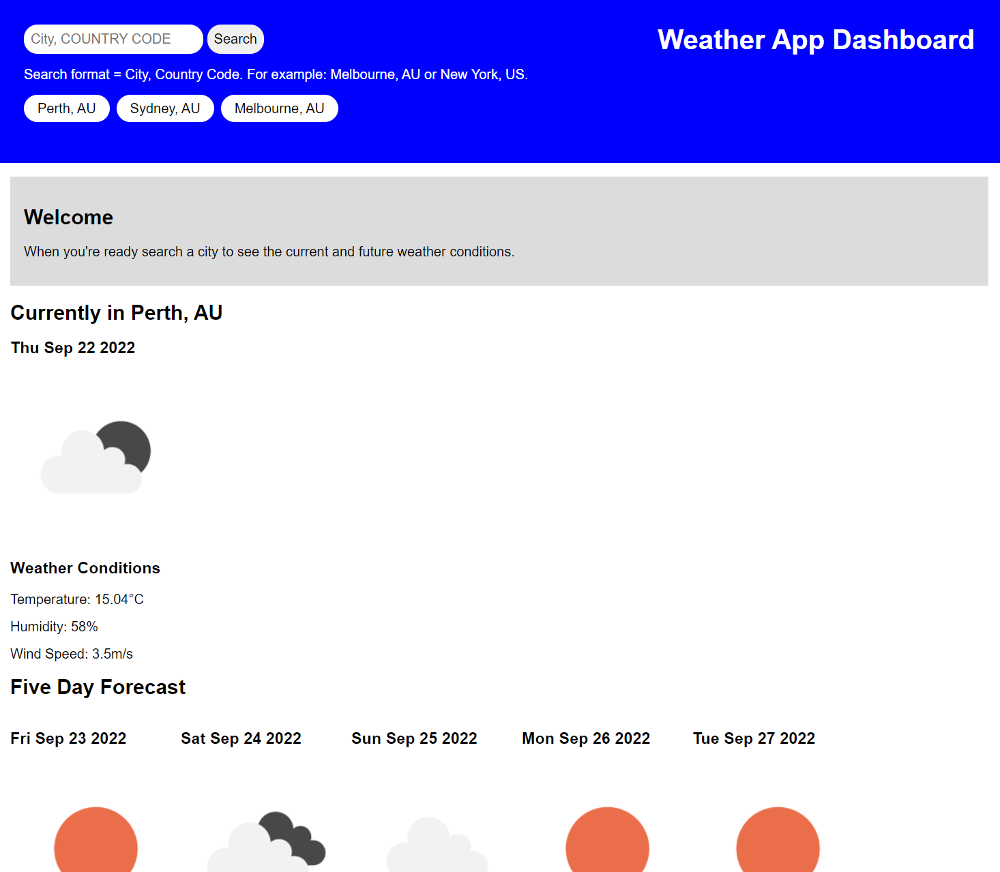

# WEATHER APP

## Description

This application allows you to search the current weather and 5 day forecast of any given city. 

The search results are displayed on the screen with the latest result being placed in front of the previous.

The current weather is displayed first with the following 5 day forecast below. Showing the weather for the middle of the day.

## Future Updates

There is still some work to be done. The application needs to add buttons to the search history results. This will allow for a more seamless user experience when comparing weather. Furthermore, the app still needs to utilise local storage and save data for each given search result. 

## Usage

Here is the link to the final application: [Weather App Dashboard](https://andrew60199.github.io/Weather-App-01/)

Above is a screenshot of the application.  

## Licences

Refer to the 'LICENSE' file 